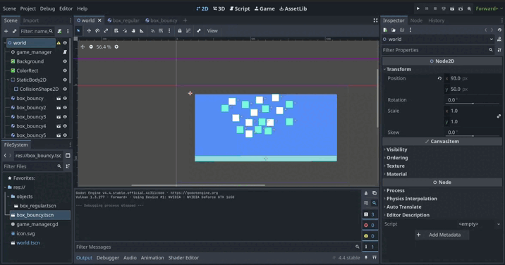

## 💻 Projeto

# projeto baixa branca


# Sobre o projeto

Aplicação com implementação de objetos e funções do Godot para desenvolvimento da interface de um jogo.

 **</>Code link Project**.

Aplicação utilizando engine godot na pratica

## Layout 





## clonar repositório

```bash
git clone git@github.com:rodrigo-teixeira-silva/Trilha_desenvolvimento_godot.git

```


# Autor

Rodrigo Teixeira Silva


## Contatos

| [GitHub](https://github.com/rodrigo-teixeira-silva) | [LinkedIn](https://www.linkedin.com/in/rodrigo-teixeira-silva/) |
| :-------------------------------------------------: | :------------------------------------------------------------: |

